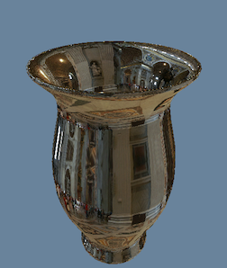

# Spherical Harmonics

This project shows how to use spherical harmonics for pre-calculating lighting in 3D environments. Spherical harmonics are primarily useful because the irradiance (incoming light) can be stored very compactly, and rendered effeciently. The traditional solution for irradience is to encode lighting in cube or spherical texture maps. The spherical harmonics method can approximate a low-frequency cube map with just 9 floating point numbers.

I created this project for my mathematics capstone course. The end result here turned out to be more of a programming project than a math one, but behind the scenes I learned a lot about the math as well.

The demo is a [Literate Program](https://en.wikipedia.org/wiki/Literate_programming). Thanks to the creator of [Literate](https://github.com/zyedidia/Literate)

## Contents

- `demo/` - The C source code for the demo program. Generated (woven) from the literate files. Requires SDL 2 to build.

- `literate/` - Commentary on the source code and a practical overview of spherical harmonics. I started this with the intention of using it for my paper, but the approach was more like an engineering project than a math one. I then switched to the approach in the papers folder. The commentary here is very incomplete and unpolished, but is probably still useful.

- `paper/functions.tex` - This paper introduces the theory of orthogonal systems and generalized fourier series from a mathematical point of view. There is no original research here. I wrote it for the purpose of understanding how Spherical Harmonics work. 

- `paper/laplace.tex` - This paper presents an organized way to transform Laplace's equation into spherical coordinates. Many differential equations textbooks mention that this can be done, but none of them actually show how to do it.

## Screenshots

Cubemap reflection.

Spherical harmonics approximation.

## Further Reading

1. [An Effecient Representation for Irradiance Environment Maps](https://graphics.stanford.edu/papers/envmap/)
2. [Shading in Valve's Source Engine](http://www.valvesoftware.com/publications/2006/SIGGRAPH06_Course_ShadingInValvesSourceEngine.pdf)

## Project License

MIT License

Copyright (c) 2017 Justin Meiners

Permission is hereby granted, free of charge, to any person obtaining a copy of this software and associated documentation files (the "Software"), to deal in the Software without restriction, including without limitation the rights to use, copy, modify, merge, publish, distribute, sublicense, and/or sell copies of the Software, and to permit persons to whom the Software is furnished to do so, subject to the following conditions:

The above copyright notice and this permission notice shall be included in all copies or substantial portions of the Software.

THE SOFTWARE IS PROVIDED "AS IS", WITHOUT WARRANTY OF ANY KIND, EXPRESS OR IMPLIED, INCLUDING BUT NOT LIMITED TO THE WARRANTIES OF MERCHANTABILITY, FITNESS FOR A PARTICULAR PURPOSE AND NONINFRINGEMENT. IN NO EVENT SHALL THE AUTHORS OR COPYRIGHT HOLDERS BE LIABLE FOR ANY CLAIM, DAMAGES OR OTHER LIABILITY, WHETHER IN AN ACTION OF CONTRACT, TORT OR OTHERWISE, ARISING FROM, OUT OF OR IN CONNECTION WITH THE SOFTWARE OR THE USE OR OTHER DEALINGS IN THE SOFTWARE.
